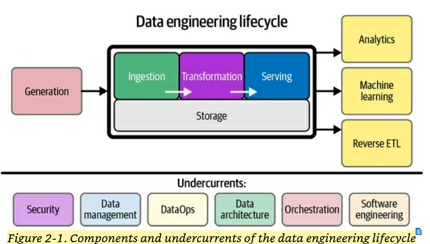

[](https://classroom.github.com/online_ide?assignment_repo_id=20614650&assignment_repo_type=AssignmentRepo)

# Premier League Match Prediction Project

## Project Overview 

### Business goal
Soccer (football) is one of the most popular sports in the world, and the English Premier League (EPL) is especially interesting because it produces new data every week. I chose this topic because I enjoy following soccer and I think it would be fun to see how data can help explain team performance.

The goal of my project is to look at Premier League match data together with a larger historical dataset from Kaggle. By combining these two sources, I want to understand what factors are most important in winning matches and see if I can predict match outcomes.

**Note:** After meeting with my instructor, I've decided to focus specifically on **team-level analysis** rather than individual players. This keeps the scope manageable while still being interesting.

**Key questions I want to answer:**
- What team statistics (like shots, possession, goals conceded) are most strongly related to winning?
- Can I build a model to predict whether a team will win, lose, or draw a given match?
- How do current EPL teams compare to historical teams in terms of performance?

### Analysis approach
My project will use both **analytics** and **machine learning**, focusing on team-level data.

- First, I will do exploratory data analysis (EDA) with charts and summary statistics to see patterns in team performance metrics like goals, shots, and possession.
- Next, I will create features based on team form (like last 5 matches), home vs away performance, and head-to-head records.
- Then I will train some classification models using **scikit-learn** (logistic regression and random forest) to predict match outcomes (win/draw/loss).
- Finally, I will evaluate the models using accuracy and confusion matrices to see how well they predict.

This approach will help me understand what makes teams successful and whether match outcomes are predictable.

### Data sources

#### Premier League Match Data API (Dynamic)
- **Overview:** This API provides up-to-date EPL match information, including fixtures, scores, standings, and team statistics.
- **Format/refresh:** JSON format. Updates weekly as matches are played.
- **How I will use it:** This is my dynamic dataset. I will use it to track the current EPL season and get recent team performance data.
- **URL:** [Football-Data.org](https://www.football-data.org/)
- **Technical details:** Approximately 380 matches per season, updates weekly, includes team stats like shots, possession, corners, etc.

#### European Soccer Database (Kaggle) — Static
- **Overview:** This Kaggle dataset includes 25,000+ matches from European leagues between 2007–2016. It has match results and team statistics.
- **Format/size:** SQLite database (~300 MB), can export to CSV.
- **How I will use it:** This is my static historical dataset. I will use it to compare current EPL teams to historical performance and to train my prediction models.
- **URL:** [Kaggle Soccer Dataset](https://www.kaggle.com/datasets/hugomathien/soccer)
- **Technical details:** 25,000+ matches, 11 European leagues, team attributes and match statistics included.

## Design - Data engineering lifecycle details

This project aligns with the data engineering lifecycle. The lifecycle is the foundation of the book, <u>Fundamentals of Data Engineering</u>, by Joe Ries and Matt Hously. A screenshot of the lifecycle from the book is shown below.



This design section describes how this project implements the data engineering lifecycle.

### Architecture and technology choices

This project uses a **lakehouse architecture** following the **medallion pattern** with Bronze, Silver, and Gold layers.

**Platform:** I will be using **Azure Databricks** for this project. I'm still deciding between using the full Azure Databricks service or Databricks Community Edition (free version), depending on data size and processing needs. Most likely I'll start with Community Edition and move to Azure if I need more resources.

**Key technologies:**
- **Databricks/PySpark:** For data ingestion and transformation
- **Python libraries:** pandas for smaller data manipulation, scikit-learn for machine learning models
- **Storage:** Databricks File System (DBFS) for file storage
- **File formats:** JSON (raw), Parquet (transformed), Delta Lake if using full Azure Databricks

The medallion architecture helps organize data at different stages of processing, making it easier to debug issues and maintain data quality.

### Data storage

**File formats by lifecycle phase:**

| Phase | Layer | Format | Reason |
|-------|-------|--------|--------|
| Ingestion | Bronze | JSON, CSV | Keep raw data in original format |
| Transformation | Silver | Parquet | Compressed, columnar format for better performance |
| Serving | Gold | Parquet or Delta | Optimized for analytics and ML |

**Data organization (folder structure):**

```
/FileStore/
  /premier_league_project/
    /bronze/
      /api_data/
        /season_2024_25/
          matches_2024_10_01.json
          matches_2024_10_08.json
          standings_2024_10_08.json
      /kaggle_data/
        Match.csv
        Team.csv
        Team_Attributes.csv
    /silver/
      /matches/
        premier_league_matches.parquet
        historical_matches.parquet
      /teams/
        team_info.parquet
    /gold/
      /features/
        match_features_for_ml.parquet
      /aggregates/
        team_season_stats.parquet
```

**Schema considerations:**
- Bronze layer: No schema changes, store exactly as received
- Silver layer: Standardized schema with consistent column names and data types across both sources
- Gold layer: Wide feature tables with one row per match containing all relevant team statistics

**Why this organization:**
- Separates raw data from processed data
- Makes it easy to reprocess if I make mistakes
- Clear separation between data sources
- Date-based folders for API data allow tracking changes over time

### Ingestion

#### Data Source 1: Premier League Match Data API (Football-Data.org)

**How I will programmatically access the data:**
- Use Python `requests` library to call REST API endpoints
- Need to register for free API key (limited to 10 requests per minute)
- Main API endpoints:
  - `/v4/competitions/PL/matches` - Get match results and fixtures
  - `/v4/competitions/PL/standings` - Get current league table
  - `/v4/matches/{id}` - Get detailed match statistics

Example code approach:
```python
import requests
headers = {'X-Auth-Token': 'MY_API_KEY'}
response = requests.get('https://api.football-data.org/v4/competitions/PL/matches', headers=headers)
data = response.json()
```

**Platform/resources:**
- **Azure Databricks Community Edition** (or full Azure Databricks)
- Running in a Databricks notebook
- Will schedule as a weekly job if possible, or run manually

**Transformations before saving:**
- **Minimal transformation** - following the principle of keeping Bronze as raw as possible
- Only add metadata: ingestion timestamp, source API endpoint
- Save complete JSON response as-is
- No data cleaning, type conversion, or filtering at this stage
- Storage location: `/FileStore/premier_league_project/bronze/api_data/season_2024_25/matches_YYYY_MM_DD.json`

**Multiple datasets from this source:**
1. **Match data** - Route: `/v4/competitions/PL/matches?status=FINISHED`
   - Contains: match results, scores, dates, team names
2. **Standings data** - Route: `/v4/competitions/PL/standings`
   - Contains: current league positions, points, goal difference
3. **Match statistics** - Route: `/v4/matches/{matchId}`
   - Contains: shots, possession, corners, fouls (if available)

I'll call these endpoints separately and save each response to its own JSON file with appropriate naming.

#### Data Source 2: European Soccer Database (Kaggle)

**How I will programmatically access the data:**
- Option 1: Manual download from Kaggle website, then upload to DBFS
- Option 2: Use Kaggle API with Python
  ```python
  from kaggle.api.kaggle_api_extended import KaggleApi
  api = KaggleApi()
  api.authenticate()
  api.dataset_download_files('hugomathien/soccer', path='./data', unzip=True)
  ```
- Option 3: Direct URL if dataset allows (still exploring this)

The SQLite file needs to be extracted, so I'll use Python's `sqlite3` library:
```python
import sqlite3
conn = sqlite3.connect('database.sqlite')
```

**Platform/resources:**
- **Azure Databricks Community Edition** (or full Azure Databricks)
- One-time ingestion (can re-run if needed)
- May do initial exploration locally on my laptop first to understand the data structure

**Transformations before saving:**
- **Minimal transformation**
- Extract specific tables from SQLite database:
  - `Match` table
  - `Team` table  
  - `Team_Attributes` table (if needed for team playing styles)
- Convert from SQLite to CSV format for easier handling
- Add ingestion_date column
- No filtering, cleaning, or schema changes
- Keep all columns even if I don't think I'll use them
- Storage location: `/FileStore/premier_league_project/bronze/kaggle_data/[table_name].csv`

**Multiple datasets from this source:**
All from the same SQLite database, but extracting these tables:

1. **Match table** 
   - Path: SELECT * FROM Match
   - Contains: 25,000+ matches with results, dates, team IDs, league info, basic stats
   
2. **Team table**
   - Path: SELECT * FROM Team
   - Contains: Team names, IDs, API IDs for linking
   
3. **Team_Attributes table** (optional, will decide after exploring)
   - Path: SELECT * FROM Team_Attributes  
   - Contains: Team playing style, formation, tactics by season

I'll save each table as a separate CSV file in the Bronze layer.

### Transformation
<Placeholder - Will be completed in next assignment>

### Serving
<Placeholder - Will be completed in next assignment>

## Undercurrents

The data engineering lifecycle has several "undercurrents" which are themes that apply throughout the whole lifecycle. The two most relevant for my project are:

### Data Management
Data management is important because I'm combining two different data sources that need to be kept consistent. Some key things I need to manage:
- Making sure team names are standardized across both datasets
- Keeping track of data quality - like checking for missing match results or weird values
- Understanding where my data came from (data lineage) so if something looks wrong I can trace it back
- Version control for my code so I don't lose work

### Orchestration  
Orchestration matters because the Premier League API updates weekly, so I need to automate the ingestion process. I'll need to:
- Schedule the API ingestion job to run automatically every week (if using full Azure Databricks)
- Make sure the transformation pipelines run after new data is ingested
- Handle errors if the API is down or returns bad data
- For now, might run manually but design it so automation is easy to add later

These are the most critical undercurrents for my project since I'm dealing with regular data updates and need reliable processes.

## Implementation

### Navigating the repo
<This section will be completed as I build out the project>

### Reproduction steps
<This section will be completed as I implement the project>