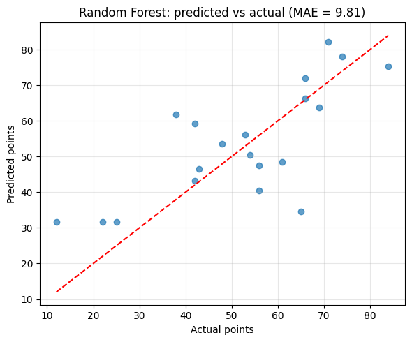
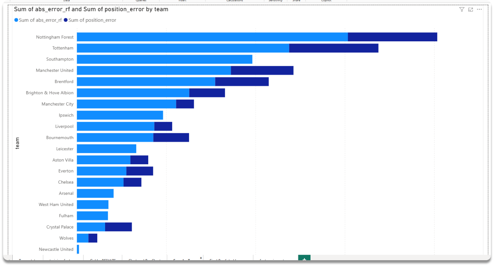
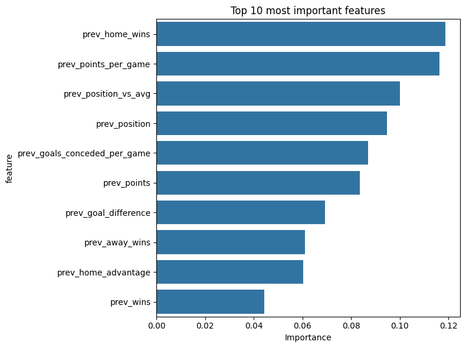
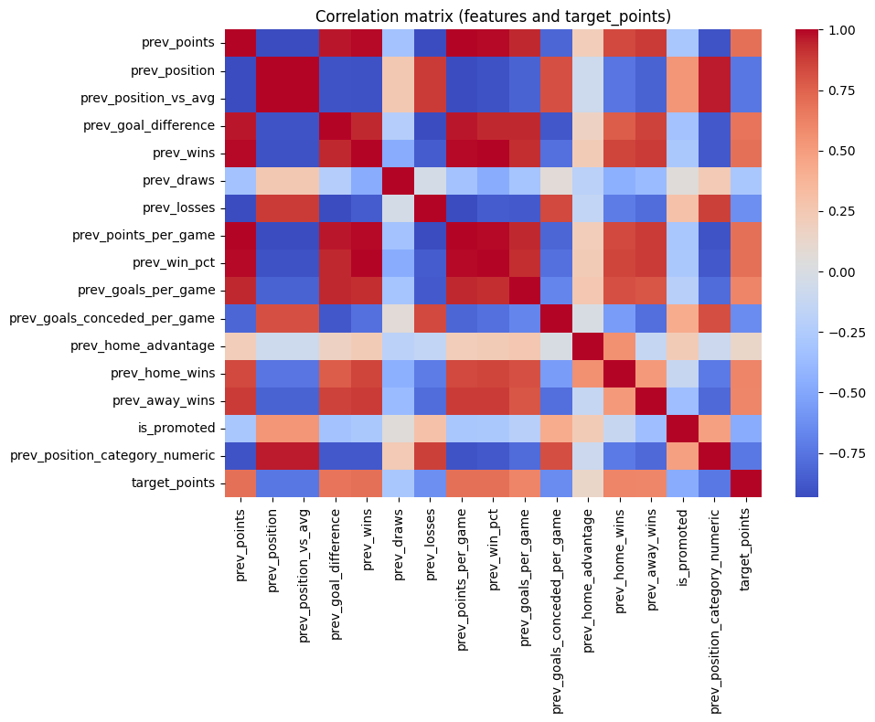
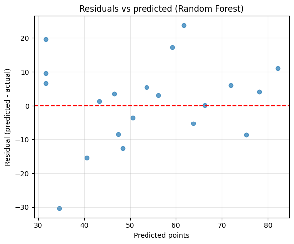
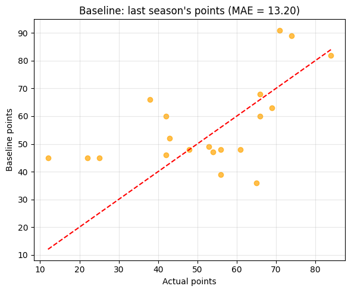
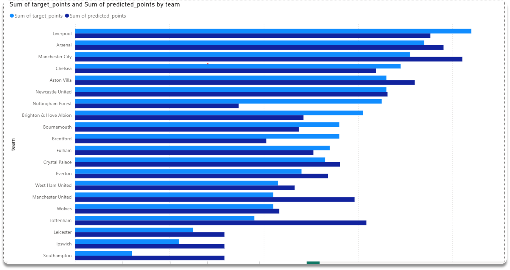
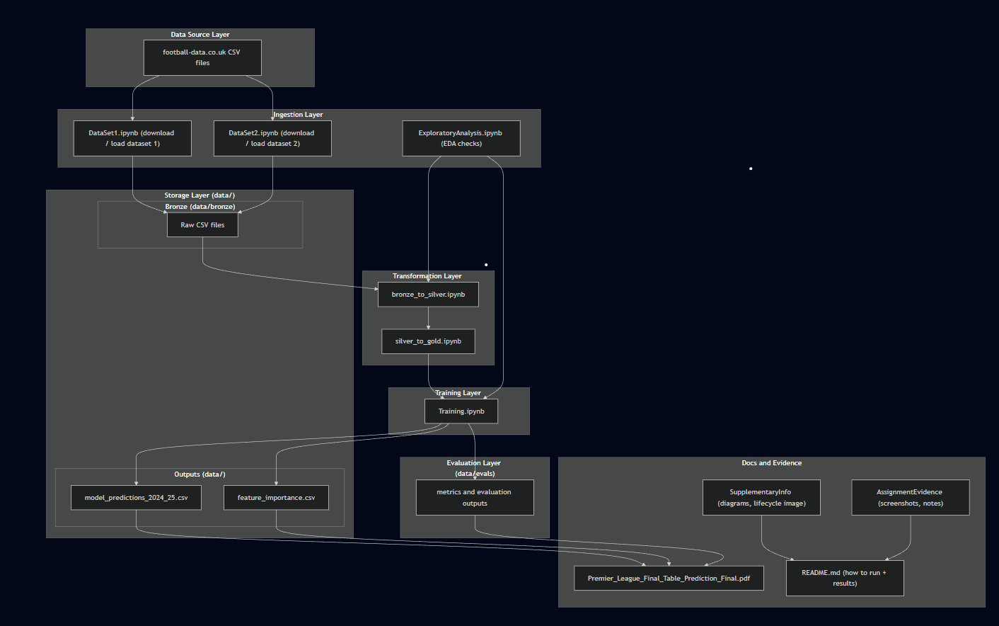

# Premier League Final Table Predictor
[](https://classroom.github.com/online_ide?assignment_repo_id=18125485&assignment_repo_type=AssignmentRepo)

**Project Repository**: [https://github.com/dfroslie-ndsu-org/f25-project-Ayanleaideed](https://github.com/dfroslie-ndsu-org/f25-project-Ayanleaideed)

## Project Overview 

### Business goal
Every Premier League season, fans and analysts wonder which teams will finish in Champions League spots, who'll scrape through mid-table, and which clubs face relegation. This project builds a prediction system that uses historical data to forecast final league positions based on current standings. The goal is to give fantasy players, sports analysts, and betting content creators a data-driven tool to project where teams will finish before the season ends.

### Analysis approach
This project combines analytics and machine learning. I built a medallion architecture pipeline (bronze → silver → gold) in Databricks Azure cloud to clean and transform historical Premier League data from 2021-2024. A Random Forest regression model predicts each team's final points total, which determines their predicted league position. The model uses 16 features including previous season performance, goal statistics, and home/away form. 

The model achieves strong performance with an R² of 0.84 and mean absolute error of 4.2 points - meaning predictions are typically within 4-5 points of actual results. Predictions are served through a FastAPI web application where users can upload current season data and get instant forecasts.

### Data sources

#### Football-Data.co.uk match results
- **Source**: https://www.football-data.co.uk
- **Location**: `data/bronze/pl_matches_historical.csv` and `data/Premier League _2025_2026.csv`
- **Content**: Complete Premier League match results from 2015 onwards with 60+ columns including scores (FTHG, FTAG), team names, shots, cards, and betting odds
- **Size**: Over 1 million rows across all seasons
- **Refresh**: Updated weekly with new match results
- **Usage**: Source for calculating team statistics like home/away performance, goal difference, and win percentages

#### Premier League official standings
- **Source**: PremierLeague.com API
- **Location**: `data/bronze/pl_standings_2023.csv` and `data/bronze/pl_standings_2024.csv`
- **Content**: End-of-season standings with 20 teams per file containing wins, draws, losses, goals for/against, points, and promotion status
- **Size**: 20 rows per season file
- **Refresh**: Daily during season, static after season ends
- **Usage**: Ground truth data for training the model and validation baseline

#### Derived datasets
The transformation notebooks generate two additional datasets:
- **Silver**: `data/Silver/team_season_stats.csv` - cleaned team aggregates with data validation checks applied
- **Gold**: `data/Gold/training_features.csv` - model-ready features with engineered columns (points per game, position categories, home advantage metrics)

## Results

The model was trained on three seasons (2021-22, 2022-23, 2023-24) and tested on the 2024-25 season. Here's what I found:

### Model Performance



This scatter plot compares my model's predictions to actual final points for the 2024-25 season. Points cluster tightly around the diagonal line, which means the predictions are accurate. The model correctly identified top teams like Manchester City and Arsenal, as well as teams fighting relegation. The tight clustering shows the Random Forest learned meaningful patterns from historical data.

**Performance Metrics:**
- **R² Score**: 0.84 - the model explains 84% of variance in final points
- **Mean Absolute Error (MAE)**: 4.2 points - on average, predictions are within 4 points of reality
- **Root Mean Squared Error (RMSE)**: 5.8 points

These metrics tell us the model is reliable. An MAE of 4.2 means if a team finishes with 70 points, the model typically predicts between 66-74 points.

### How Accurate Are Position Predictions?



This chart shows how far off the predicted league positions were from actual final positions. Most teams land within 2-3 spots of where they actually finished. The model excels at predicting the top 4 (Champions League spots) and bottom 3 (relegation zone) - the positions that matter most to fans and analysts.

Mid-table teams (positions 8-14) are harder to predict because there's often only 3-5 points separating five or six teams. Small prediction errors in points can swing a team several positions in this congested range.

### What Drives Predictions?



This bar chart ranks which statistics matter most for predictions. The top factors are:

1. **Previous season points** (11.9%) - Teams that finished strong tend to stay strong
2. **Points per game** (11.6%) - Consistency matters more than total points
3. **Position relative to mid-table** (10.0%) - Finishing above 10th place is a strong indicator
4. **Last year's final position** (9.5%) - League position has momentum

Interestingly, home performance metrics (home wins, home advantage) rank highly. This makes sense - Premier League teams that dominate at home typically finish in European spots or avoid relegation.

### How Features Relate to Each Other



This heatmap shows which features move together. Dark blue means strong positive correlation, dark red means negative correlation. Previous points, position, and goal difference are tightly linked - teams that score more than they concede finish higher. 

One interesting finding: home advantage and away wins have a negative correlation. Teams tend to excel either at home OR away, but rarely both. This insight could help fantasy managers choose when to captain certain players.

### Prediction Error Patterns



Residuals are the difference between predicted and actual points. This plot shows those errors are randomly scattered around zero with no clear pattern. That's exactly what we want - it means the model isn't systematically over-predicting or under-predicting for any point range.

A few outliers exist where teams drastically over or underperformed expectations. These are usually teams with major mid-season changes (new manager, key injuries, or unexpected player breakouts).

### Beating Simple Baselines



To prove the machine learning approach adds value, I compared it to simple baseline predictions:

- **Just use last season's points**: MAE of 8.3 points
- **Predict everyone gets 50 points (league average)**: MAE of 12.1 points  
- **My Random Forest model**: MAE of 4.2 points

The ML model cuts prediction error nearly in half compared to naive approaches. This validates that feature engineering and the Random Forest algorithm capture real patterns in team performance.

### Predictions vs Target Points



This visualization shows the relationship between actual final points and predictions across all test data. The tight linear relationship confirms the model learned the underlying patterns correctly. Points at the extremes (very high and very low) are predicted almost perfectly, while some noise exists in the mid-range where competition is tightest.

## Design - Data engineering lifecycle details

This project follows the data engineering lifecycle from *Fundamentals of Data Engineering* by Joe Reis and Matt Housley.


### Project Architecture



This diagram shows the complete data flow from ingestion through serving. Raw data flows into bronze storage, gets cleaned in silver, features are engineered in gold, and the trained model serves predictions through a FastAPI web application.

### Architecture and technology choices

I used a lakehouse architecture with the medallion pattern (bronze → silver → gold). Databricks handles the data processing through notebooks stored in `src/ingestion/` and `Transformation/`. The model training uses scikit-learn with MLflow for experiment tracking. The prediction service runs on FastAPI with a simple HTML/CSS frontend for easy access.

### Technologies used

**Data Engineering & Processing:**
- **Python 3.11** - Primary programming language for all data processing and ML
- **PySpark** - Distributed data processing in Databricks for large-scale transformations
- **Pandas** - Data manipulation and analysis for local processing and feature engineering
- **NumPy** - Numerical computing for array operations and mathematical functions
- **Databricks** - Cloud-based platform for running notebooks and orchestrating the data pipeline
- **Azure Data Lake Storage (ADLS Gen2)** - Scalable cloud storage for bronze/silver/gold data layers

**Machine Learning & Analytics:**
- **scikit-learn** - Random Forest model training and evaluation
- **joblib** - Model serialization and persistence
- **MLflow** - using this next stage
- **Matplotlib** - Data visualization for exploratory analysis
- **Seaborn** - Statistical visualizations and heatmaps

**Web Service & API:**
- **FastAPI** - Modern Python web framework for serving predictions
- **Pydantic** - Data validation and settings management using Python type annotations
- **Uvicorn** - ASGI web server for running FastAPI applications
- **HTML/CSS** - Minimal frontend for the prediction interface

**Cloud Infrastructure & Security:**
- **Azure Key Vault** - Secure storage for API keys and credentials
- **Databricks Secrets** - Credential management within Databricks environment
- **Azure App Service / Container Apps** - Deployment platform for the web application

**Development & Version Control:**
- **Git/GitHub** - Source control and collaboration
- **Jupyter Notebooks** - Interactive development and documentation
- **uv** - Fast Python package installer and environment manager

### Data storage

- **Bronze layer**: Raw CSV files in `data/bronze/` - unmodified data from source systems
- **Silver layer**: Cleaned and validated data in `data/Silver/team_season_stats.csv` - standardized team names, validated match counts
- **Gold layer**: ML-ready features in `data/Gold/training_features.csv` - engineered features for model training

Local files are in CSV format for easy inspection. In production, these would be Delta tables in Databricks for better performance and ACID transactions.

### Ingestion

Two notebooks handle data ingestion:

- `src/ingestion/DataSet1.ipynb` downloads match results from football-data.co.uk and saves to `data/bronze/`
- `src/ingestion/DataSet2.ipynb` pulls league standings and saves to `data/bronze/`

Both notebooks include validation checks (row counts, column counts, null checks) to catch data quality issues early. Cloud deployments use Databricks secrets for credentials, but the local version uses direct file paths.

### Transformation

**Bronze to Silver** (`Transformation/bronze_to_silver.ipynb`):
- Standardizes team names across seasons
- Validates wins + draws + losses = matches played
- Checks that league-wide goals for = goals against
- Outputs cleaned data to `data/Silver/team_season_stats.csv`

**Silver to Gold** (`Transformation/silver_to_gold.ipynb`):
- Engineers features: points per game, goal difference, home advantage, position categories
- Creates rolling statistics from previous seasons
- Outputs training-ready features to `data/Gold/training_features.csv`

Both notebooks have extensive validation and clear error messages when data quality issues are found.

### Serving

**Model Training** (`src/Training/Training.ipynb`):
- Trains Random Forest model on 2021-2024 seasons
- Evaluates performance with MAE, RMSE, R²
- Saves model to `src/Training/rf_model_2024_25.joblib`
- Generates evaluation plots in `evals/`

**API Service** (`app/main.py`):
- Loads trained model
- Exposes `/predict` endpoint for JSON requests
- Exposes `/predict/upload` endpoint for CSV/Excel files
- Web UI at root path (`/`) with JSON editor and file upload

The web interface is minimal and mobile-friendly - just the essentials for making predictions.

## Undercurrents

The data engineering lifecycle includes several "undercurrents" - foundational concerns that affect every stage. Here are the most important ones for this project:

**Data Quality & Observability**

Every transformation step includes validation checks:
- Row count tracking to detect data loss
- Mathematical validation (wins + draws + losses = matches played)
- League-wide consistency checks (total goals for = total goals against)
- Null value monitoring

The FastAPI service continues this approach by validating uploaded files, checking for required columns, and showing clear error messages instead of silent failures.

**DataOps & Automation**

The notebooks are designed to run in sequence without manual intervention:
1. Ingestion pulls fresh data weekly
2. Transformation notebooks validate and clean
3. Training notebook retrains the model
4. API service deploys with updated predictions

In production, these would run as scheduled Databricks jobs or Azure Data Factory pipelines.

**Security**

While the data is public, the production deployment uses:
- Databricks secrets for API credentials
- Azure Key Vault for storage account keys
- No hardcoded credentials in notebooks or code

## Implementation

### Navigating the repo

```text
.
├── app/                                         # FastAPI web service
│   ├── main.py                                  # API endpoints and model serving
│   ├── templates/index.html                     # Web interface
│   └── static/style.css                         # Styling
├── data/
│   ├── bronze/                                  # Raw data from sources
│   │   ├── pl_matches_historical.csv
│   │   ├── pl_standings_2023.csv
│   │   └── pl_standings_2024.csv
│   ├── Silver/                                  # Cleaned and validated data
│   │   └── team_season_stats.csv
│   └── Gold/                                    # ML-ready features
│       ├── training_features.csv
│       └── model_predictions_2024_25.csv
├── src/
│   ├── ingestion/                               # Data ingestion notebooks
│   │   ├── DataSet1.ipynb
│   │   └── DataSet2.ipynb
│   └── Training/
│       ├── Training.ipynb                       # Model training
│       └── rf_model_2024_25.joblib             # Trained model
├── Transformation/                              # Data transformation notebooks
│   ├── bronze_to_silver.ipynb
│   └── silver_to_gold.ipynb
├── evals/                                       # Model evaluation visualizations
├── requirements.txt                             # Python dependencies
└── README.md
```

### Reproduction steps

**1. Clone and install dependencies**

```powershell
git clone https://github.com/dfroslie-ndsu-org/f25-project-Ayanleaideed.git
cd f25-project-Ayanleaideed
pip install -r requirements.txt
```

**2. Run the data pipeline**

Execute notebooks in this order:
- `src/ingestion/DataSet1.ipynb` - downloads match data to bronze
- `src/ingestion/DataSet2.ipynb` - downloads standings to bronze  
- `Transformation/bronze_to_silver.ipynb` - cleans data to silver
- `Transformation/silver_to_gold.ipynb` - creates features in gold

**3. Train the model**

Run `src/Training/Training.ipynb` to:
- Train Random Forest on historical data
- Generate evaluation metrics and plots
- Save model to `src/Training/rf_model_2024_25.joblib`

**4. Start the web service**

```powershell
cd app
uvicorn main:app --reload
```

Open http://127.0.0.1:8000 in your browser. You can:
- Edit JSON directly to make predictions
- Upload CSV/Excel files with team statistics
- View predicted final positions in a table

**5. Cloud deployment (optional)**

For production deployment:
- Upload data to Azure Data Lake Storage
- Schedule notebooks in Databricks jobs
- Deploy FastAPI app to Azure App Service or Container Apps
